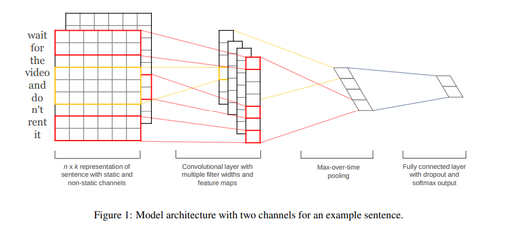
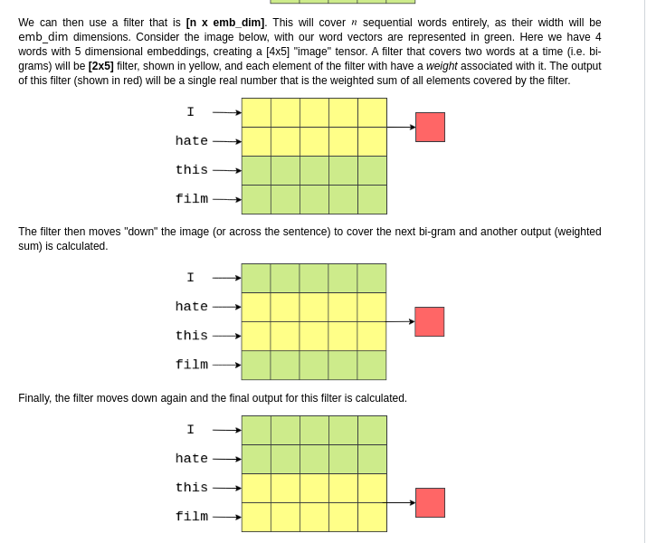
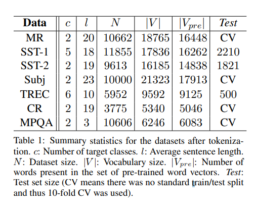
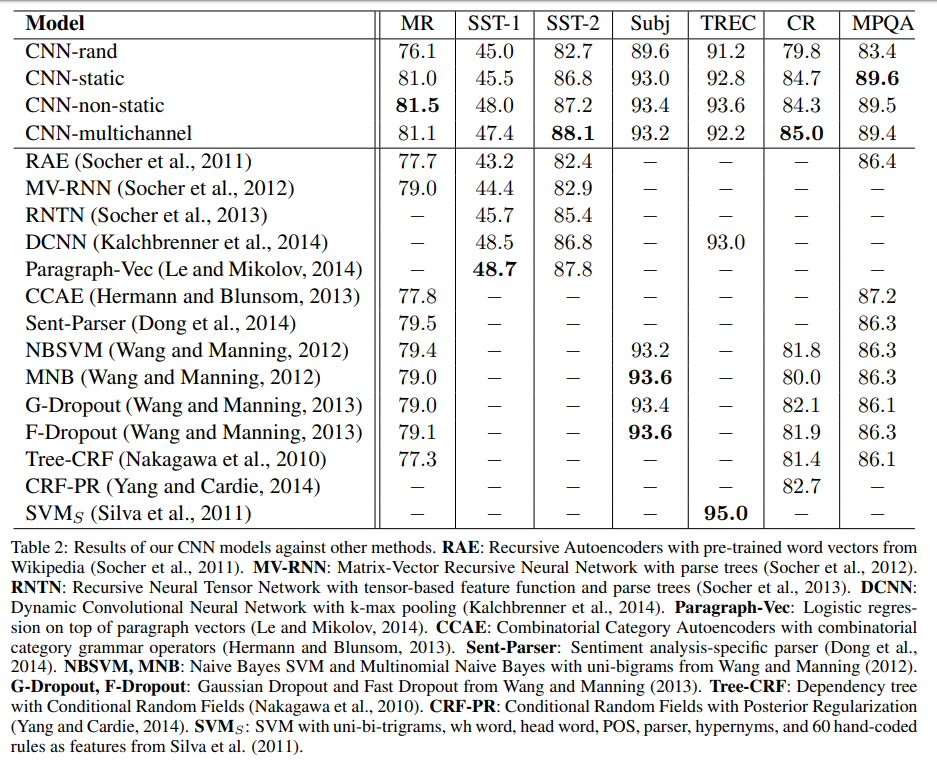

# [Convolutional Neural Network for Sentence Classification](https://arxiv.org/pdf/1408.5882.pdf)

- experiments with CNN trained on top of pretrained word vectors for sentence level classification tasks
- the proposed model improved SOTA on 4/7 tasks including sentiment analysis and question classification
  

## Introduction

NLP --> lots of work in learning word vector representation using NN + performing composition over learned word vectors for classification (*paper: Benigo, 2003, Mikolov, 2013, Collobert, 2011*)

Word vectors --> Words are projected from sparse 1-to-V encoding onto a lower dimensional vector space via a hidden layer -- works as feature extractor that encode semantic features of words in their dimensions.
Semantically close words are closer in these dense representations.

**CNN in NLP:** 
1. Semantic parsing (Yih, et al., 2014)
2. Search query retrieval (Shen et al., 2014)
3. Sentence modeling (Kalch-brenner et al., 2014)
4. Traditional NLP tasks (Collober et al., 2011)

**This paper:**
 - Train simple CNN with one layer of convolution on top of word vectors obtained from NN models
 - Obtains good results on multiple benchmark--suggests that pretrained word-vectors might be "universal"
 - Philosophically similar to *Razavian et al., 2014*:  feature extractors of pretrained deep models work well on variety of tasks including the ones very different from the original task

## Model

$x_i \in R^k$ is the k-dimensional word vector corresponding to $i^{th}$ owrd in the sentence. So, a padded sentence of length n is represented as:  
$x_{1:n}=x_1+x_2+x_3+...+x_n$ here, "$+$" representes concatenation. 
Convlution filter, $w \in R^{hk}$, is applied to a window of h words to produce new feature. 

Here k is the embedding dimensions of the words. So, the convolution filter goes over several words' embedding vectors to generate new features.

let, the produced feature map from one position be:
$c = [c_1,c_2,c_3,.....,c_{n-h+1}]$ and $c \in R^{n-h+1}$ 
After this, max pooling is applied over the feature map to capture the most important feature from each feature map.

So, one filter extracts one feature, and multiple such filters' output features form the penultimate layer and are passed to a fully conneced softmax layer for getting the probability ditrbution over the labels.

They experimented with two channels word vector -- one channel was kept static, where as other was fine tuned via BP. The figure illustrates the two channel model.

**Regularizations:** 
+ dropout in the penultimate layer with $l_2$ norms of the weight vectors

## Datasets

**Hyperparameters and training:** 
+ ReLu
+ filter windows of 3,4,5 with 100 feature maps each
+ dropout rate of 0.5
+ $l_2$ constraint of 3
+ minibatch size of 50
+ Pretrained 300d word vectors of *word2vec* trained on 100 billion words from Google News.
  
**Model Variations:** 
- CNN-rand: all words are randomly initialized and learned during training
- CNN-static: all words are from pretrained *word2vec*, unknown words randomly initialized and kept static
- CNN-non-static: same as CNN-static, but pretrained vectors are fine-tuned
- CNN-multichannel: 2 sets of word vectors each is treated as channel, but one is static whereas other is not, while both being initialized with *word2vec* 

## Results

