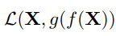
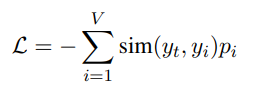
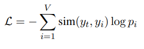
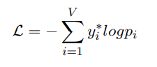
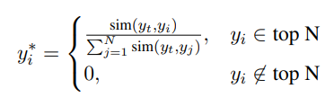
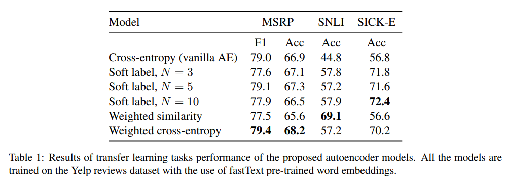
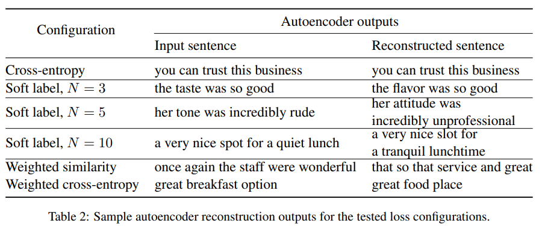

# [Similarity-Based Reconstruction Loss for Meaning Representation](https://www.aclweb.org/anthology/D18-1525.pdf), Kovaleva, et. al., EMNLP 2018

## Abstract
- Using Autoencoder framework, proposed and evaluated several loss functions that can be used as an alternative to the commonly used cross entropy reconstruction loss.
- proposed loss functions use similarities between words in the embedding space and can be used to train any neural model for text generation
- proposed loss functions amplify semantic diversity in the reconstructed sentences while preserving original meaning of the input.
- evaluated generated representation on paraphrase detection and language inference tasks

## Introduction

- Encoder-Decoder architecture dependent NLP tasks rely heavily on cross-entropy reconstruction loss to generate target output
- cross entropy penalizes whenever exact match is not produced.
- Many NLP tasks don't need exact words and may allow near-synonym or just symanitcally close words
- Cross entropy penalizes semantically close but different outputs.

**Contribution:**  
- introduce and experiment with a series of distance-based reconstruction losses
- test on paraphrase detection, entailment/inference.
- substantial improvement in performance if semantic meaning similarity is used in loss.

## Related Work

- All mentioned works either propose and develop task-specific architectures or use large corpora of labeled data to learn embeddings at a sentence level

## Experiments

- Classic autoencoder objective: minimize the difference between given input **`X`** and reconstructed output **`X′`**
  
  
Here, `L` is the loss function, `f` is encoder and `g` is decoder.

**Weighted Similarity Loss:**  
  
Here, `p_i` is the softmax probability over vocabulary size, `y_i` is predicted token, `y_t` is ground truth token.
- This loss encourages the model to produce high probabilities for words that are close to the target word.
- Current experiment uses Cosine Similarity measure.  

**Weighted Cross-entropy Loss:**  

- Every ground-truth token is represented with similarities to other words in the vocabulary rather than with a traditional one-hot encoding scheme.

**Soft Label Loss:**  

- ground truth tokens are encoded to their similarities across the vocabulary but only top N closest words are kept and probability is normalized among them so that ∑`y_i* = 1`
- Can be interpreted as cross entropy with soft targets.
- Vary N from 3 to 10 in experiments and exclude common english stop-words from soft target encoding. Regular cross entropy is used for reconstructing the stop words.

**Training Parameters:**

- Pretrained FastText word vectors is used to compute similarities between words.
- Used Yelp restaurant reviews dataset
- autoencoder is implemented in PyTorch
- Encoder and Decoder both are single layer LSTMs each with hidden size of 256 units
- Train/val/test = 70/10/20
- vocabulary size of training dataset: 9.5K
- Adam optimizer with learning rate between `1e-3` and `1e-4`
- SentEval toolkit is used for testing learned representations

## Discussion
- all but weighted similarity loss outperforms vanilla cross entropy on all three tasks. (MSRP, SNLI, SICK-E)

## Conclusion
- Introduced loss functions that uses word-level distributional similarities between generated output and ground truth.
- Proposed loss functions help produce more diverse output while preserving the underlying semantics.