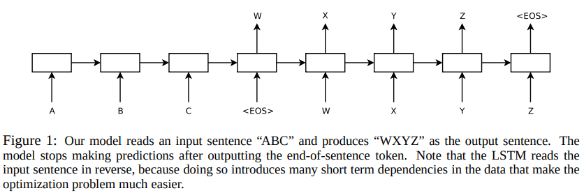

# [Sequence to Sequence Learning with Neural Networks](https://arxiv.org/pdf/1409.3215.pdf)

- DNNs work well on large labeled training sets
- DNNs can't be used to map sequences to sequences
- presented general Seq2Seq with minimal assumptions on the sequence structure
- uses multilayer LSTMs to map input to a fixed vector, then another deep LSTM to decode the target from the fixed vector
- WMT'14 dataset used, LSTM BLEU score 34.8
- LSTM learned long sequences
- Reversing order of input sequences improved LSTM's performance: doing so introduced many short term dependencies between source and target sequence = easier optimization

## Introduction
**Why DNN is not Enough:**
- DNN: speech recognition, visual object recognition
- DNN: sort N N-bit numbers using only 2 hidden layers of quadratic size **PAPER: [27]**
- DNN can find good solutions using large network as long as enough labeled data is available
- Limation of DNN: inputs and targets need to have fixed dimensional vector representation
- Speech recognition, Machine translation, Question answering == Seq2Seq problem--> doesn't have fixed dimensionality

LSTMs can solve general Seq2Seq2 problems:
- Use one LSTM to read the input sequence one time step at a time to obtain large fixed dimensional vector representation
- Use another LSTM to extract the output sequence from that fixed dimensional vector
- Second LSTM is a RNN language model conditioned on the input sequence

**Main Results:**
- obtained BLEU score of 34.81 on WMT'14
- Rescored SMT baseline using LSTM, obtained BLEU score of 36.5
- Reversed order of input sequences helped a lot
- Qualitative evaluation supports that their model is word order aware and fairly invariant to active and passive voice

## The Model
Differs from traditional LSTM in three ways:
- used two different LSTMSs: one for input, andother for output
- found that deep LSTM outperforms shallower ones, so chose 4-layer LSTMs
- found extremely valuable to reverse the order of the words of the input sequence

## Experiments

Used WMT'14 English to French translation dataset

## Conclusion
- Large Deep LSTM can outperform standard Statistical Machine Translation (SMT) based system with unlimited vocabulary in a large-scale MT task.
- Reversing words of source sentences was extremely useful.
- LSTMs trained on the reversed dataset had little difficulty translating long sentences.