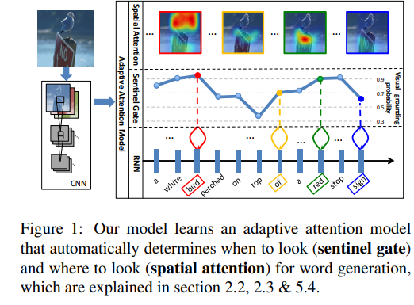
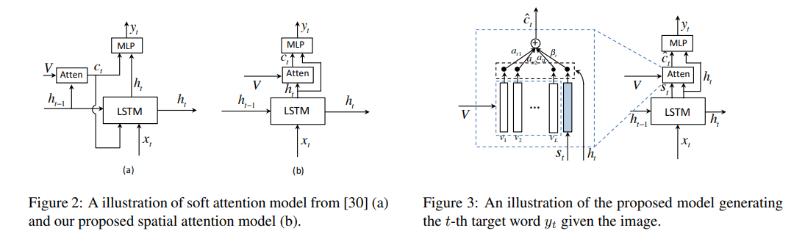
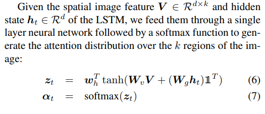
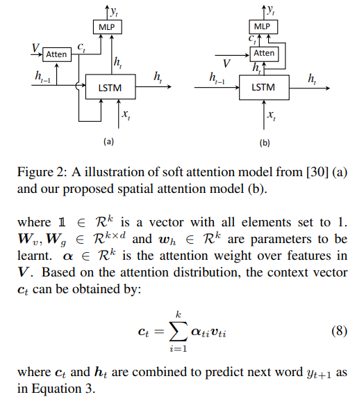
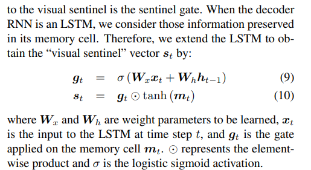
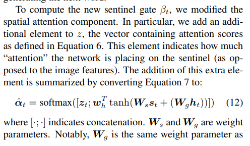
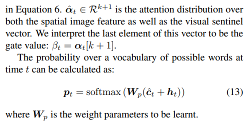
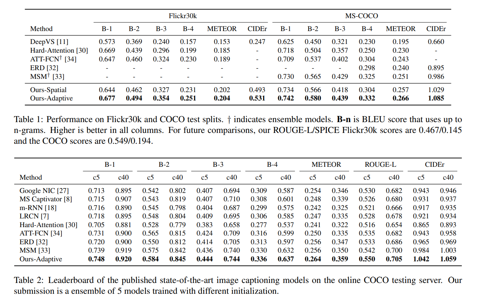
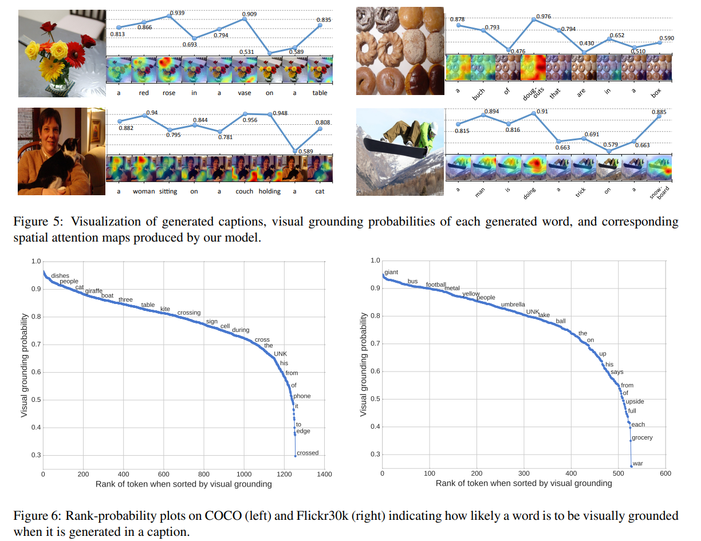
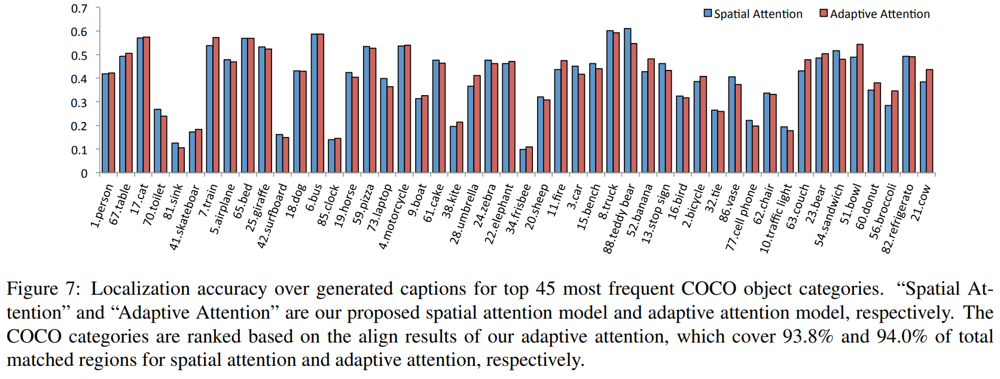

# [Knowing When to Look: Adaptive Attention via A Visual Sentinel for Image Captioning](https://arxiv.org/pdf/1612.01887.pdf), CVPR 2017

## Abstract
- Most methods force visual attention to be active for every generated word
- Decoder doesn't need visual information for predicting non-visual words like "the", "of", etc. SOme other seemingly visual words may be predicted reliably just from language model alone.
- Paper proposes novel adaptive attention model with a visual sentinel
- At each time step, model decides whether to attend to the image or to the visual sentinel
- SOTA on COCO and Flickr30k

## Introduction

- to generate high quality captions models need to incorporate fine-grained visual clues from the image.
- Visual attention based encoder-decoder models have been explored where the attention mechanism produces spatial map highlighting image regions relevant to each generated word
- most attention models for image captioning and visual question answering attend to the image at every time step, but not all words in the caption have corresponding visual signals.
- Example:  

- gradients from non-visual words could reduce the effectiveness of the visual signal in guiding the caption generation process
- this paper => adaptive attention encoder-decoder framework which can automatically decide when to use visual information and when to just use the language model
- Novel spatial attention model for extracting spatial image features
- LSTM extension as an adaptive attention mechanism → produces additional visual sentinel vector instead of a single hidden state
- visual sentinel vector is an additional latent representation of the decoder's memory that provides a fallback option to the decoder
- designed a new sentinel gate which decides how much visual information from image should be used instead of visual sentinel when generating the next word

## Method

### Encoder Decoder for Image Captioning

- encoder-decoder framework models image captioning using RNNs as followed:  
`log p(y_t | y_1, y_2, ... , y_t-1, I) = f(h_t, c_t)` where `h_t` is the hidden state of RNN and `c_t` is the context vector extracted from image `I` at time step `t`.
- This paper uses LSTMs,  where `h_t = LSTM(x_t, h_t-1, m_t-1)`, `m_t-1` is the memory cell state at time `t-1`
- `c_t` is an important factor for caption generation as it provides visual evidence for caption generation
- Two ways to model the context vector `c_t`: vanilla encoder-decoder and attention-based encoder-decoder
- Vanilla Encoder-Decoder: `c_t` is only dependent on the encoder, a CNN. Image I is fed to the CNN, which extracts the last fully connected layer as a global image feature. When generating captions, the context vector `c_t` is kept constant and doesn't depend on the hidden state of the decoder
- Attention based Encoder-Decoder: `c_t` is dependent on both encoder and decoder. At time step `t`, based on hidden state, the decoder attend to the specific regions of the image and compute `c_t` using the spatial image features from a conv layer of a CNN. Attention based models are shown to be superior in generating captions.

### Spatial Attention Model
- `c_t = g(V, h_t)`, where g is attention function, `V = [v_1, ... , v_k], v_i ∈ R^d` is the spatial image features, each of which is a d-dimensional representation corresponding to a part of the image. `h_t` is the hidden state of RNN at time t.
- Given, image feature vector `V ∈ R^(d×k)` and hidden state `h_t ∈ R^d`, feed these through a single layer NN followed by a softmax to generate the attention distribution over k regions of the image.

- Motivation stems from Residual Network: generated context vector `c_t` can be considered as the residual visual information of current hidden state `h_t` which complements the informativeness of the current hidden state for next word prediction.

### Adaptive Attention Model

- Spatial attention based decoders cannot determine when to rely on visual signal and when to use language model only.
- introduce visual sentinel ⇒ a latent representation of what the decoder already knows
- Extend spatial model with visual sentinel → results in an adaptive model that is able to determine whether it needs to attend the image to predict next word
- Decoder's memory stores both: long term and short term visual and linguistic information → model extracts new component from these to fallback on when it doesn't want to attend to the image → sentinel gate decides whether to attend to the image or to the visual sentinel.
- LSTMs memory/cell state is used for creating the "visual sentinel" vector `s_t`

- proposed adaptive attention model to compute the context vector based on the visual sentinel
- compute the new context vector as a mixture of sentinel vector and image's features: `c_t = β_t*s_t + (1-β_t)*c_t`
- `β_t` is the new sentinel gate at time step `t`
- To compute `β_t`, add additional element to `z`, vector containing attention scores which indicates how much attention the network is placing on the sentinel

## Implementation Details

- encoder uses a CNN to get the representation of images
- used ResNet's last convlayer's outputs of shape 2048 × 7 × 7
- Global Image features is obtained by averaging the feature vectors of the 7 × 7 locations
- converted global feature vector and spatial feature vectors to a fixed new dimension `d`. Global feature vector is used along with the word embeddings to produce `x_t`
- Similarly single layer NN is used to convert `s_t` and LSTM output `h_t` to the same dimension `d`
- single layer LSTM with hidden size of 512 is used
- Adam optimizer with learning rate of `5e-4` for language model and `1e-5` for CNN; momentum: 0.8; weight-decay: 0.999
- Fine tune CNN, after 20 epochs; batch size: 80
- Train for upto 50 epochswith early stopping if the validation CIDEr score had not improved over the last 6 epochs.
- Used beam size of 3 when samping the caption for both COCO and Flickr datasets.

## Results

- Used Karpathy's splits for COCO and Flickr30k
- Truncated captions longer than 18 in COCO and longer than 22 in Flickr30k; Build vocab with words recurring at least 5 & 3 times in training set for COCO and Flickr30k resulting in a vocabulary of 9567 and 7649 words.
- Compared full model with the ablated version → to make sure that improvements are not result of orthogonal contributions
- Later compared with DeepVS, Hard-Attention, ATT, ERD, MSM
- To visualize attention → upsample spatial attention weights α to image size (224 × 224) using bilinear interpolation
- Also visualized sentinel gate value 1-β visual grounding probability → shows that the model attends to image regions less when generating non visual words
- Adaptive attention generated by the model is analyzed to make sure the model is attending on the image regions correctly
- Plotted average visual grounding probability by words to show that model attends more on visual words than on non-visual words
- Plotted localization accuracy to show that the model looks at proper objects when generating words.

