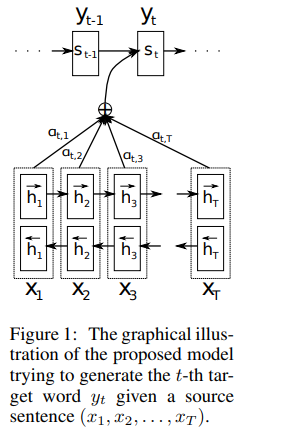
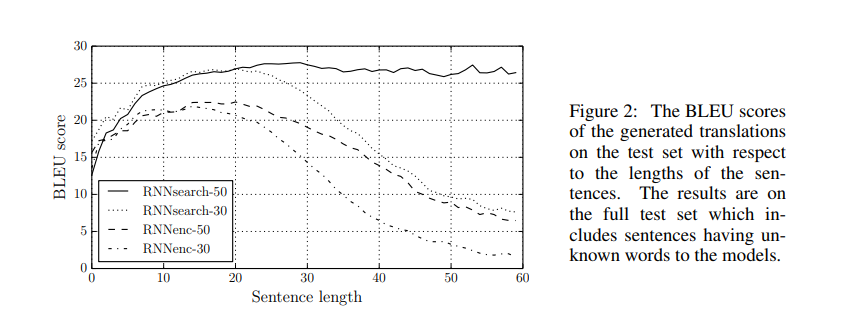
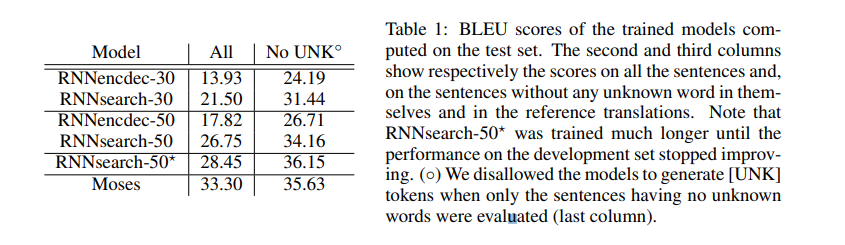
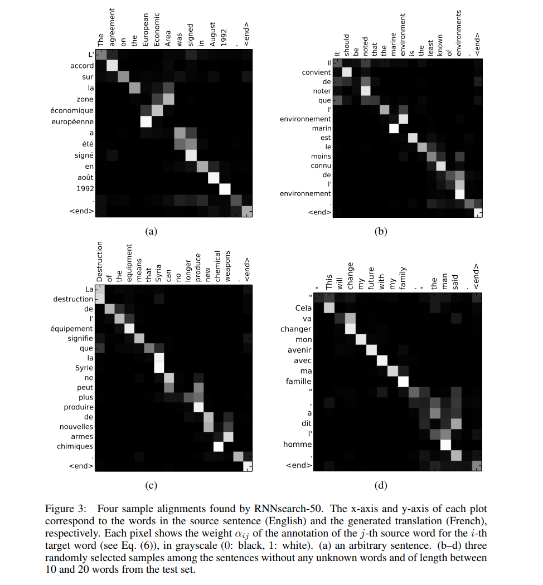

# [Neural Machine Translation by Jointly Learning to Align and Translate](https://arxiv.org/pdf/1409.0473.pdf)
**FIRST PAPER AFAIK TO INTRODUCE THE CONCEPT OF ATTENTION**

- NMT: build a single NN that can be jointly tuned to maximize the translation performance.
- Recent models: Family of encoders and decoders.
- conjecture: fixed length vector used in encoder-decoder architectures is a bottleneck in improving performance
- proporsed to allow network automatically search for parts of a source that are relevant ot predicting a target word.
- Comparabale SOTA performance on Engilsh to French translation
- Qualitative analysis of the alignments reveals that the alignments agree well with intuition.

## Introduction
- NMT - build and train a single large network that reads a sentence and outputs a correct translation
- Most NMT systems -> encoder-decoder, where encoder and decoder are language specific
- Encoder: reads sentence and converts it to a fixed length vecotr
- Decoder: using the encoded vector produces output
- Encoder-Decoder system is jointly trained to maximize the probability of a correct translation given a source sentence
- Potential issue: Encoder needs to compress all information of input in a fixed length vector--> long sentences are harder to process, performance deteriorates as sentence length increases --> solution: extend encoder-decoder to let the system align and translate jointly.
- Each time model generates a word in a translation --> search for set of positions in a source sentence where the most relevant information is concentrated. Model then predicts a target word based on the context vectors associated with these source positions and all previous generate target words.
- Difference with normal Enc-Dec: this model doesn't try to encode whole input into single fixed length vector.
- Encodes input sentence into sequence of vectors and choose adaptively a subset of these encoded vectors during decoding --> NNs don't need to compress full source sentence into a fixed length vector --> better coping with longer sentences.
- Significant performance gain, especially for longer sentences, qualitative analysis shows that proposed model finds plausible alignment between source and translated sentences.

## Background: NMT

- translation $≡$ find a target sentece y, so that $\arg \max_yp(y|x)$, where x is the source sentence.
- NMT: maximize conditional probability of sentence pairs.
- Scoring phrase pairs in phrase table (?????)

### RNN Encoder-Decoder
**T is sequence length, which can be different in encoder and decoder, but for simplicity and avoid unnecessary complexity, I removed encoder specific T, i.e. $T_x$ and decoder specific T, i.e. {T_y}, and wrote just T. x is the source, y is the target,** 

Encoder reads a sequence of vectors, $x = (x_1,x_2,....,x_{T})$ into a vector $c$, known as context vector. 
Most common approach to produce the context vector is:  $h_t=f(x_t,h_{t-1})$ and $c=q({h_1,...,h_T})$ 

Decoder --> predict the next word $y_{t^′}$ given the context vector $c$ and all previously predicted words: $\{y_1,...y_T\}$ 
i.e., $p(\boldsymbol{y})=\Pi_{t=1}^T p(y_t|\{y_1,...y_{t-1}\},c)$, where $\boldsymbol{y} = (y_1, ....,y_T)$

## Learning to Align and Translate
- Uses bidirectional RNNs as encoder-decoder which searches through source sentence during decoding.

### Decoder: General Description

Each conditional probability: $p(y_i|y_1,...,y_{i-1},\boldsymbol{x}) = g(y_{i-1},s_i,c_i)$ 
where $s_i$ is RNN hidden state for time step $i$, $s_i = f(s_{i-1},y_{i-1},c_i)$ 
Context vector $c_i$ is distinct for each target word $y_i$. IT depends on a sequence of annotations, $(h_1,...,h_T)$, to which the Encoder maps the source sentence. Each annotation $h_i$ has information about the whole input sequence with a strong focus on the parts surrounding the $i^{th}$ word. Context vector, $c_i$ is computed as the weighted sum of these annotations $h_i$:   $c_i = \sum^T_{j=1}α_{ij}h_j$ 
The weight $\alpha_{ij}$ of each annotation $h_j$ is computed by: 
$\alpha_{ij} = \frac{\exp(e_{ij})}{\sum_{k=1}^T\exp(e_{ik})}$, where, $e_{ij} = a(s_{i-1},h_j)$ 
Here, $e_{ij}$ is an alignment model which scores how well the inputs around position $j$ and output at $i$ match. The score is based on decoder RNN hidden state, $s_{i-1}$ and $j^{th}$ annotation $h_j$ of the input sentence.

- Parameterized alignment model $a$ as a FF NN which is jointly trained with all other components.
- Alignment is not a latent variable here, but alignment model directly computes soft alignment.
- Taking weighted sum of all annotations == computing expected annotation
- If, $α_{ij}$ is probability that target word $y_i$ is  aligned to, i.e. translated from source word $x_j$, then $i^{th}$ context vector, $c_i$ is the expected annotation over all the annotations with probabilities $α_{ij}$
- The probability $\alpha_{ij}$ or associated energy, $e_{ij}$ marks the importance of annotation $h_j$ w.r.t. $s_{i-1}$ in deciding the n ext state $s_i$ and generating $y_i$. Implicitely, this implements a mechanism of attention in the decoder. The decoder decides parts of source sentence to pay attention to. This is how fixed length vector related bottleneck is overcome. Information can be spread throughout the annotations and decoder will learn to pay attention to the relevant parts during training.

### Encoder: Bidirectional RNN for Annotating Sequences

- Wanted to annotations to summarize both: preceding words and following words, for each of the words in the sequence --> so, used bidirectional RNNs.
- BiRNN: two RNNs--> forward and backward
- forward RNN's, $\overrightarrow{f}$ hiddens states, $(\overrightarrow{h_1},...,\overrightarrow{h_T})$
- backward RNN's, $\overleftarrow{f}$ hiddens states, $(\overleftarrow{h_1},...,\overleftarrow{h_T})$
- Annotation for each word $x_j$: concatenate both hidden states, $h_j = [\overrightarrow{h_j}, \overleftarrow{h_j}]$
- Due to RNNs' tendency to better represent recent inputs, $h_j$ will be focused on the words around $x_j$

## Experiment Settings
Used ACL WMT'14 parallel corpora for English-to-French translation task. Reduced the size of combined corpus to have 348M words using **Axelrod et al.** Shortlisted 30K most frequent words, and kept only those, any word not in those 30K are encoded as \<UNK\>.

Two models: RNN Encoder-Decoder (RNNenc) and newly proposed model (RNNsearch), 30 and 50 are the sequence length for the models. All details of the models are in the paper. Used beamsearch to generate the most plausible translation.

## Results

