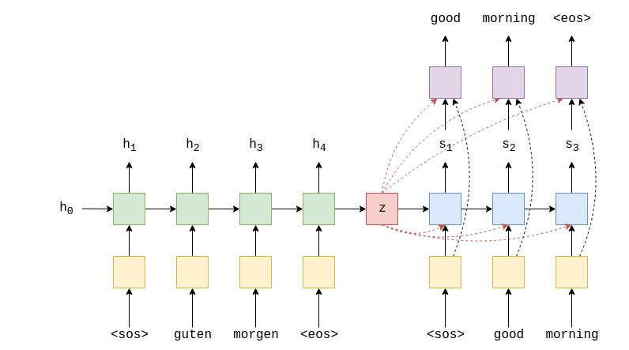
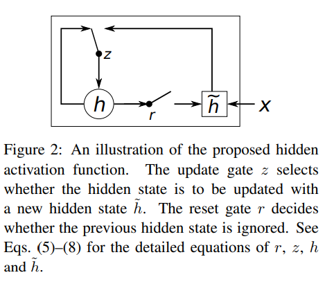

# [Learning Phrase Representations using RNN Encoder-Decoder for Statistical Machine Translation](https://arxiv.org/pdf/1406.1078.pdf)

- novel neural network model called RNN Encoder-Decoder, consisting of two RNNs. One encodes sequences of symbols to fixed length vector, other decodes the representation into another sequence of symbols.
- Encoder and decoder are joinly  trained to maximize the conditional probability of a target sequence given a source sequence
- Show that proposed model learns a semantically and syntactically meaningful representation of linguistic phrases

## Introduction

- Paper focuses on a NN that can be used as a part of the conventional phrase-based SMT
- model consists of two RNNs -- <Encoder, Decoder> Pair
- Improves performance of SMT, when used for scoring the phrases used in the SMT
- Qualitative analysis shows, this model is better at capturing linguistic regularities in phrase table
- models learns a continuous space representation of a phrase that preserves semantic and syntactic structure of the phrase

## RNN Encoder-Decoder

#### RNN
- RNN: NN with hidden state, h and optional output y, operating on a variable length sequence $x=(x_1,...,x_T)$.
- RNN can learn probability distribution over a sequence by being trained to predict the next symbol in a sequence. For example, a multinomial distribution (1-of-K coding) can be output using a softmax activation function.
- By combining probabilities of the individual tokens (words), we can compute the probability of the sequence. 
$p(sequence)=p(word_1)*p(word_2)*......p(word_T)$, where T is the length of the sequence.

#### RNN Encoder -- Decoder

- One RNN encode a variable length sequence into a fixed-length vector representation
- Another RNN decode the fixed-length vector to another variable length sequence
- From probabilistic perspective, the model learns the conditional distribution over a variable length sequence conditioned on another variable length sequence: $p(y_1,...,y_{T'}|x_1,...,x_{T})$, where length of input (T) and output (T') may differ.
- After the Encoder finished reading the input sequence, the hidden state of the RNN is a summary $c$ of the whole input sequence.
- Decoder, uses this summary $c$ as it's initial hidden state. Additionally, in Decoder, both $y_t$ and $h_t$ are conditioned on $c$. So,
instead of $h_t = f(h_{t-1},y_{t-1})$,  we have $h_t = f(h_{t-1},y_{t-1},c)$
- Moreover, probability distribution of next symbol in Decoder changes from $g(h_t)$ to  $g(h_t, y-1, c)$  

- The two components are jointly trained to maximize conditional log-likelihood over all the sequence pairs in the training set.
-  Once trained, model can be used in two ways:
   1. map an input sequence to output sequence 
   2. score a given pair of input and output sequences, where the score is simply a probability $p_\theta(y|x)$

#### Hidden Unit that Adaptively Remembers and Forgets
- Motivated by LSTMs but much simpler to computer and implement

Activation for the jth hidden unit:

computation for reset gate, $r_j = \sigma([W_rx]_j+[U_rh_{t-1}]_j)$ 
computation for update gate, $z_j = \sigma([W_zx]_j+[U_zh_{t-1}]_j)$ 
output of the hidden unit,$h_j^t = z_jh_j^{t-1}+(1-z_j)\widetilde{h}^t_j$ 
where$\widetilde{h}^t_j = \phi([Wx]_j+[U(r\odot h_{t-1})]_j)$ , $\phi$ is an activation function that can be, $\tanh, \sigma,$ etc.

Explanation:
1. when reset gate is close to zero (r~0), the hidden state is forced to ignore the previous hidden state and reset with current input allowing hidden state to drop any information that is irrelevent later in the future.
2. Update gate controls how much information from the previous hidden state will carry over to the current hidden state, helping the hidden cell remember long-term information.
3. Each hidden unit has separate reset and update gate, so each will learn to capture dependencies over different time scales. Units learning short term dependencies will have reset gates that the frequently active, whereas units learning long term dependencies will have update gates that are mostly active.

## SMT
goal is to find translation f, given a source sentence e, which maximizes $p(f|e)∝p(f)p(e|f)$, where $p(e|f)$ is called the translation model and $p(f)$ is called a language model. Most SMT systems model $\log p(f|e)$ as a log linear model with additional features and corresponding weights: 
$\log p(f|e) = \sum^N_{n=1}w_nf_n(f,e)+\log Z(e)$, where $f_n, w_n$ are $n^{th}$ feature and corresponding weight and $Z(e)$ is a normalization constant independent of the weights but tuned to maximize BLEU score on validation set.

- NN used to rescore translation hypotheses (n best lists)
- Recently train NN to score the translated sentence using a representation of the source sentence as additional input

#### Scoring Phrase pairs with RNN Encoder-Decoder

- Train the model on table of phrase pairs and use its scores as additional features in the log-linear model when tuning the SMT decoder.
- Ignore normalized frequencies of each phrase pairs in the original corpora to reduce computational expense and ensure that the model doesn't simply learn to rank the phrase pairs according to their number of occurrences. The existing translation probability in the phrase table already reflects the frequencies of the phrase pairs in the original corpus.
- model needed to mostly focus on learning linguistic regularities.

#### Related Approaches
- Schwenk, 2012: similar approach for scoring phrase pairs: FF. (has max length problem)
- Delvin, 2014: FF to create translation model. (has max length problem)
- ...

## Experiments
 - Evaluated on WMT'14 workshop.
#### RNN Encoder-Decoder
- 1000 hidden units in Encoder and Decoder
- Embedding dimension 100
- Activation for $\widetilde{h}$ = $\tanh$
- have a single intermediate layer with 500 maxout units each pooling 2 inputs.
- Initialization Weights: Gaussian distribution of zero mean and 0.01 std, except for the recurrent weight parameters.
- Adadelta with $ϵ=10^{-6}$ and $\rho = 0.95$.

# THE REST SEEMED VERY CONFUSING TO ME, WILL BE BACK LATER