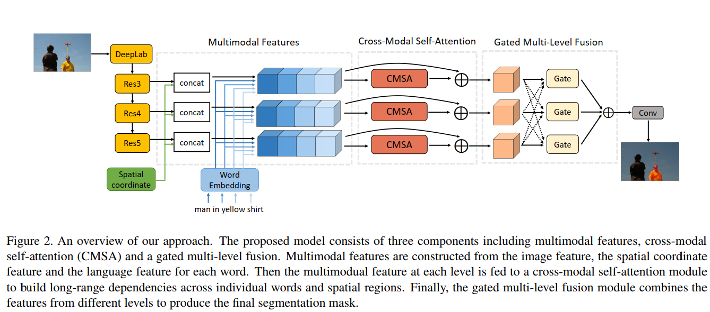

# [Cross-Modal Self-Attention Network for Referring Image Segmentation](https://arxiv.org/abs/1904.04745)
---

- Referring Image Segmentation: Given image and a natural text expression --> segment the object referred by the language expression in the image.
- Existing works: treat the language and the input image separately --> don't capture long-range correlations between these two modalities
- CMSA module: effectively captures dependencies between linguistic and visual features, adaptively focus on informative words in the referring expression and important regions in the input image
- gated multi-level fusion module: selectively integrate self-attentive cross-modal features corresponding to different levels in the image, controls information flow of features at different levels
- validated on 4 evaluation datasets; outperformed SOTA

## Introduction
- Referring image segmentation: intersection of NLP and Computer Vision
- Given image and natural expression produce segmentation mask in the image corresponding to entities referred by the natural language expression
- referring expression can contain appearance attributes (colors, shape, etc.), actions and relative relations along with the object categories.
- Can be used in interactive photo editing and human-robot interaction. 
**Popular approach**: use CNN and RNN to separately represent the image and referring expression. Concatenate the representations to produce final pixel wise segmentation result. 
**Limitation:** language encoding module may ignore some fine details of some individual words that are important to produce an accurate segmentation mask. 
**Sequential Multimodal Interaction Learning:** The visual feature is sequentially merged with the output of LSTM based language model at each step to infer a multimodal representation. 
**Limitation:** multimodal interaction only considers the linguistic and visual information individually within their local contexts and may not be able to capture global interaction information essential for semantic understanding and segmentation 

**CSMA: Cross-Modal Self-Attention Module** 
- effectively learn long-range dependencies from multimodal features that represent both visual and linguistic information
- Can adaptivelyfocus on important regions in the image and informative keywords in the language desription.

**Contributions:**
- A cross-modal self-attention method for referring segmentation which captures long range dependencies between linguistic and visual contexts.
- A gated multilevel fusion module to selectively integrate multi-level self-attentive features which effectively capture fine details for precise segmentation masks.
- An extensive empirical study on four benchmark datasets --> SOTA.

## Related Work
**Semantic Segmentation:**
- FCN takes advantages of fully convolutional layers to train a segmentation model in an end-to-end way by replacing fully connected layers in CNN with convolutional layers.
- DeepLab adopts dilated convolution to enlarge the receptive field and uses atrous spatial pyramid pooling for multi-scale segmentation to alleviate the down-sampling issue and enlarge the semantic context
- Pyramid pooling module enhances the use of multi-scale structure
- More accurate segmentation masks were generated after lower level features brought more detailed information to complement higher level features.

**Referring Image Localization and Segmentation:**
- Goal is to localize specific objects in an image according to the description of a referring expression.
- explored in Natural Language Object retrieval and modeling relationships.
- Referring Image segmentation generates segmentation mask instead of bounding box --> more precise results
- First work: extract linguistic features using LSTM, extract visual features using CNN, concatenate and generate spatial mask.
- Directly combining visual features with each word feature from a language LSTM better achieved word-to-image interaction.
- Convolutional LSTMs were used to progressively refine segmentation masks from high-level to low-level features sequentially.

**Attention**:
- used in various NLP tasks to capture keywords for context.
- multimodal domain-> uses keywords to re-weight the importance of image regions for image caption generation, image question answering and referring image segmentation
- used in modeling subject, relationship and object
- Self-attention is proposed to attend a word to all other words for learning relations in the input sequence. Improved MT performance.
- Self-attention is used in videos to capture long term dependencies in videos across temporal frames.

## Model

- Given, image and referring expression
- Use CNN to extract visual feature maps at different levels from the input image
- Create Embedding for the words in referring expression
- Append the embedding vectos of the words to the visual feature map to produce multimodal feature map, so there's a feature map for each word in the referring expression.
- CSMA converts these multimodal feature maps to self-attentive feature maps which captures long-range dependencies of both linguistic and visual information of the inputs
- Combine the self-attentive features from multiple levels using a gating mechanism to produce final features used for generating the segmentation output.

**Motivation for the Model:**
- we need detailed information about certain individual words
- previous works generate a vector representation using LSTM from the entire referring expression, which is then combined with the visual features for referring image segmentation.
- the vector representation produced by LSTM captures the maening of the entire referring expression while missing sufficiently detailed information of some individual words needed for the referring image segmentation task
- this issue is addressed in this work as they didn't used LSTM to encode the entire referring expression and so, it can capture detailed word-level information
- Some previous works process each word in the referring expression and concatenate it with visual features to infer the referred object in a sequential order using a recurrent network, this method only looks at local spatial regions and lack interaction over long-range spatial regions
- this issue is addresed in this work as they used a cross-modal self attention module that can effectively model long-range dependencies.
- the proposed method employs a novel gated fusion module for combining multi-level self-attentive features which is different from using ConvLSTM to refine segmentation with multi-scale visual features sequentially.

#### Multimodal Features
- backbone CNN network to extract visual features from the input image: Feature map extracted from layer is referred as: $V \in \Reals^{H \times W \times V_c}$
- For description with N words, one-hot encode each word and project it to embedding $e_n \in \Reals^{C_l}$
- spatial coordinate features have been shown to be helpful for referring image segmentation, this paper uses 8-D spatial coordinate feature at each spatial position.
- first 3-d: horizontal positions, next 3-d: vertical position, next 1-d: width of the image, last 1-d: height of the image
- construct multimodal feature representation at each spatial position for each word by concatenating the visual features, word vectors and spatial coordinate features
- let $p$ be a spatial location in the feature map $V$, i.e. $p \in \{1,2,3,.....,H \times W\}$
- $v_p \in \Reals^{C_v}$ --> slice of visual feature vector at the spatial location p
- spatial coordinate feature of the location $p$ is denoted as $s_p \in \Reals^8$
- Multimodal feature $f_{pn}$ corresponding to the $p^{th}$ location and $n_{th}$ word: 
    $f_{pn}=Concat(\frac{v_p}{||v_p||_2},\frac{e_n}{||e_n||_2}, s_p)$
- where $||\cdot||$ is $L_2$ norm
- Feature vector $f_{pn}$ encodes information about the combination of a specific location $p$ in the image and the $n^{th}$ word $w_n$ in the referring expression with a total dimension of $C_v+C_l+8$
- Let, $F= \{f_{pn}:\forall p, \forall n\}$, then dimension of $F$ is $N \times H \times W \times (C_v+C_l+8)$

#### Cross-Modal Self-Attention

- multimodal feature F is large and may contain a lot of redundant information
- F is variable sized and depends on the number of words in the language description and it's difficult to exploit F to produce the segmentation output
- Proposed cross-modal attention module to jointly exploit attentions over multimodal features.
- designed cross modal self attention module can capture longrange dependencies between the words in a referring expression and different spatial locations in the input image.
- The module takes $F$ as input and produces a feature map that summarizes F after learning the correlation between the language expression and the visual context.