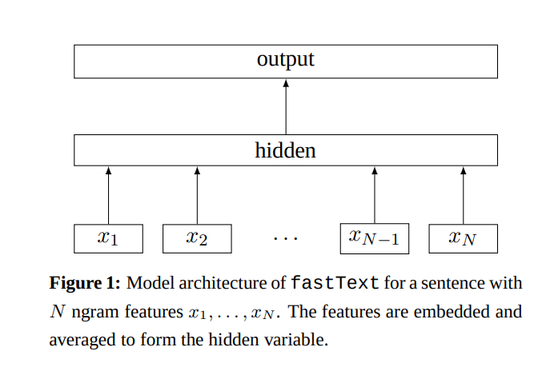
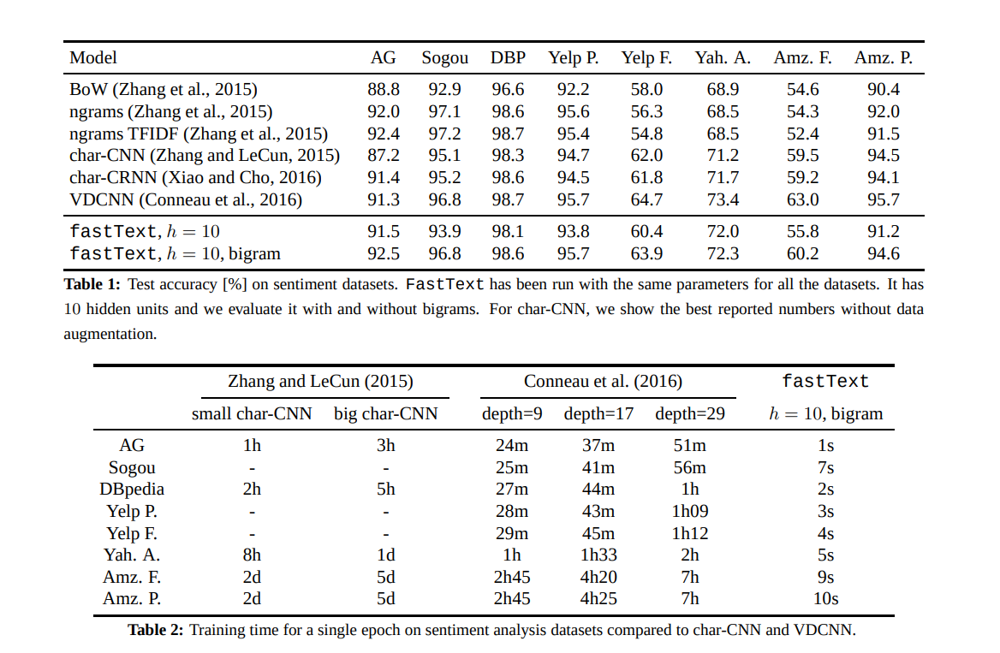

# [Bag of Tricks for Efficient Text Classification](https://arxiv.org/pdf/1607.01759.pdf)

- paper introduces a simple and efficient baseline model for text classification
- often on par with deep learning classifiers in terms of accuracy and many times faster for training and evaluation.
- train on 10B words in less than 10 minutes using standard multi-core cpu and classify 500K sentences among 312K classes in less than a minute.

## Introduction
Text classification applications:
- web search
- information retrieval
- ranking
- document classification

NN models -- provide good performances but relatively slow in train and test time -- limits usage in very large datasets.

Linear classifiers -- simple but can obtain SOTA if right features are selected. These scale to very large corpus.

*This paper explore ways to scale linear classifiers to very large corpus in context of text classification.*
- inspired by recent work in word representation learning
- shows that linear models with a rank constraint and fast loss approximation can train faster while achieving performance on par with SOTA.
- Evaluate *fastText* on tag prediction and sentiment analysis.

## Model Architecture 

*Simple and efficient baseline for sentence classification --> represent sentence as Bag of words --> train linear classifier like SVM, logistic regression, etc.*

**Problem**: these don't share parameters between classes and features possibly limiting their generalization especially when some classes don't have enough examples.

**Solution**: 
 + factorize the linear classifier into low rank matrices (*paper: Efficient estimation of word representations in vector space, Mikolov, et al.*)
 + use multilayer NN (*paper: Character Level CNN for text classification, Zhang, et al.*)

Figure 1 represents the model.
+ First weight matrix is a look up table (embedding) for the words. The word representations are averaged into a text representation and fed to a linear classifier.

+ Softmax function is used to compute the probability distribution over the predefined classes
+ The model was trained using SGD and linearly decaying learning rate.
+ Hierarchical softmax was used
+ bag of words is word order invariant and taking order into account is computationally expensive. so, authors used a bag of n-grams as additional features to capture some partial information about the word order. This is comparable to the models that uses the order explicitly.
+ maintained memory efficient mapping of the n-grams using *hashing trick*. (*paper: Feature hashing for large scale multitask learning, Weinberger, el al.*)
+ Evaluated on Sentiment analysis (low output space), Tag prediction (larger output space)

## Experiments

## Learned things
+ sentiment analysis and tag prediction dataset 
+ TFIDF
+ fastText is really fast!!

[Good implementation](https://github.com/bentrevett/pytorch-sentiment-analysis/blob/master/3%20-%20Faster%20Sentiment%20Analysis.ipynb)