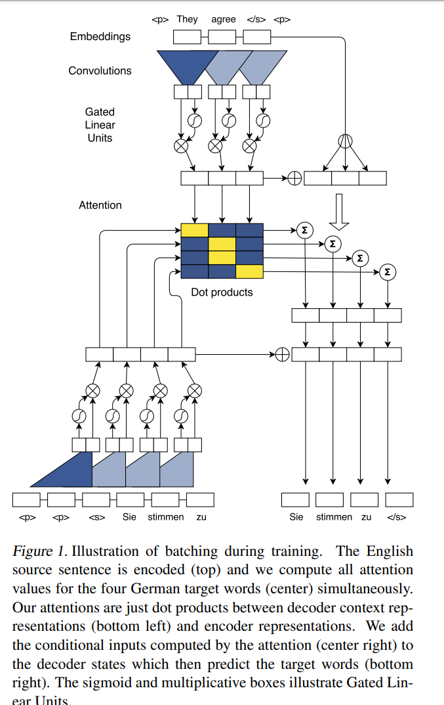
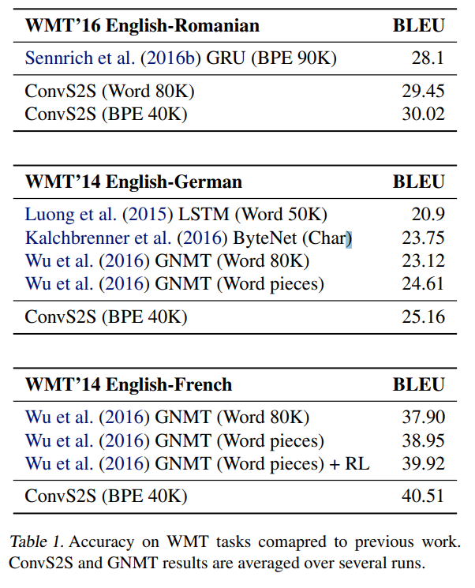
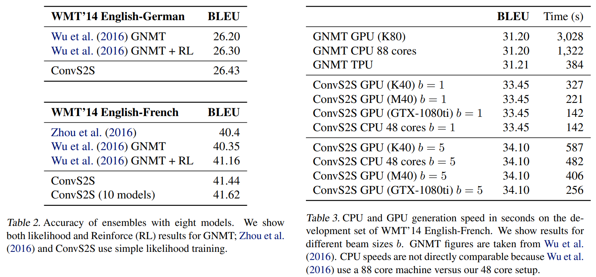
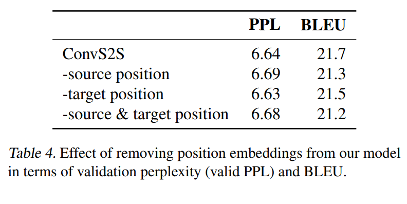
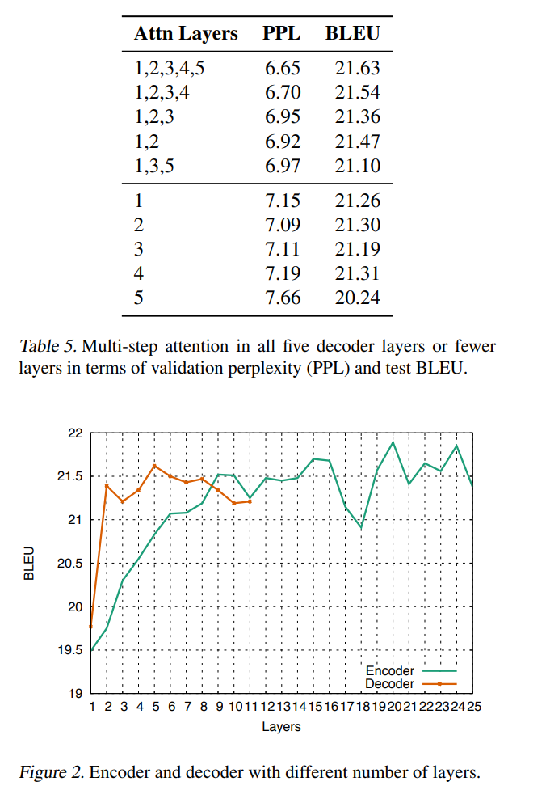
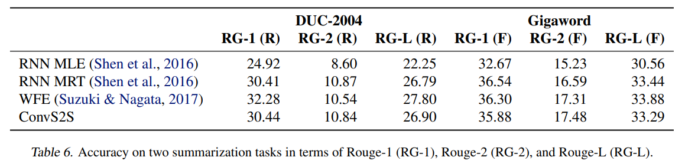
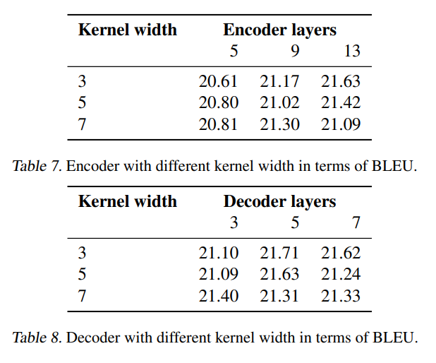

# [Convolutional Sequence to Sequence Learning](https://arxiv.org/pdf/1705.03122.pdf)

- traditional approach: using RNNs to map variable length input to variable length output
- This paper introduced architecture based on entirely CNNs
- computations can be parallelized to better use GPU hardware
- optimization is easier as number of nonlinearity is fixed and independent of the input length
- Gated Linear Unit eases gradient propagation
- Each decoder has a separate attention module
- outperformed deep LSTM in accuracy and speed

## Introduction

- RNN based Encoder-Decoder model with attention mechanism outperforms traditional SMT systems
- CNNs are less common in sequence modeling
- Convolutions create fixed size context representations, which can be made larger by stacking several layers on top of each other, allowing to control maximum length of dependencies to be modeled.
- CNNs can be parallelized as it doesn't depend on previous time step's computation
- Multilayer CNNs create heirarchical representations over the input sequence.
- Nearby input elements interact at lower  layers whereas distant elements interact at higher layers.
- Heirarchical structure provides shorter path to capture long range dependencies
- We can get a feature represntation capturing relationships within a window of n words by applying only $O(n/k)$ convolutions for kernels with width $k$, compared to linear number $O(n)$ for RNNs.
- Inputs through CNNs are fed through a fixed number of kernels and non-linearities compared to variable number of steps required for RNNs.
- This paper's model: fully convolutional architecture for seq2seq: used GLU, Residual COnnections and an attention mechanism in every decoder layer.

## RNN based Seq2Seq

- Models are primarily based on Encoder-Decoder family
- Encoder RNN processes input sequence $x$ and produces a state representation $z$
- Decoder RNN takes $z$ and generates output sequence $y$
- To generate output, $y_{i+1}$, Decoder first generates a new hidden state $h_{i+1}$ based on previous hidden state $h_i$, an embedding $g_i$ of previous output $y_i$, and a conditional input $c_i$ derived from encoder output $\boldsymbol{z}$
- Models without attention consider the final encoder state $\boldsymbol{z_m}$ by setting $c_i=z_m$ for all $i$, or using $\boldsymbol{z_m}$ to initialize the Decoder's first state ($c_i$ is not used)
- Models with attention compute $c_i$ as weighted sum of all $(z_1,...,z_m)$ at each time step. The weights of the sum are referred to as attention scores which allow the network to focus on different parts of the input sequence as it generates output sequences.
- Attention scores are computed by comparing each encoder state $z_j$ to a combination of the previous Decoder state $h_i$ and last output of decoder $y_i$, the result of the attention is then normalized to get a distribution.
- Popular RNNs are LSTMs and GRUs.
- Most recent approaches rely on bidirectional encoders to build representation of past and future context
- Many layers models often rely on shortcut or residula connections.

## Convolutional Architecture

#### Position Embeddings
- Embed input elements in an embedding matrix, $D∈\Reals^{v×f}$
- To give the model a sense of order, embed the absoulte position of input elements in another embedding matrix $D∈\Reals^{v×f}$
- Combine both matrices to obtain input element representations, $\boldsymbol{e} = (w_1+p_1,...,w_m+p_m)$
- Same procedure is done for the output element generated by decoder before feeding those generated outputs back to the network
  
#### Convolutional Block Structure

- simple block structure computes intermediate states based on fixed number of input elements
- Output of $l^{th}$ block in decoder network, $h^l = (h_1^l,...,h_n^l)$
- Output of $l^{th}$ block in encoder network, $z^l = (z_1^l,...,z_n^l)$
- Each block contains a 1D conv followed by a non-linearity.
- A decoder network with single block and kernel width k have resulting states $h_i^1$ that contains information over k input elements.
- Stacking multiple layer on top of each other increases the number of input elements represented in a state.
- Each convolution kernel of a layer has parameters, $W\in \Reals^{2d×kd}, b_w\in\Reals^{2d}$.
- Each convolution kernel takes $X\in\Reals^{k\times d}$ as input, which is a concatenation of $k$ input elements in $d$ dimensions and produces single output element $Y\in \Reals^{2d}$ that has twice the dimensionality of the input elements. 
- Subsequent layers work over the $k$ output elements of the previous layer.
- Used GLU as the non-linearity, a simple gating mechanism.
- Let, output of convolution be, $Y=[A    B]\in \Reals^{2d}$, then,  $GLU(Y) = υ([A   B]) = A⊗σ(B)$, $A,B\in \Reals^d, ⊗$ is pointwise multiplication, $σ(B)$ controls which inputs A of the current context are relevant. $υ([A   B])\in \Reals^d$, half of the input size
- $\tanh$ nonlinearity can also be applied, but GLU is better for language modeling.
- Residual connections are added from the input of each convolution to the output of the block, $h_i^l = υ(conv)+h_i^{l-1}$
- padding is applied to the network to make sure that input stays the same size for all convolutional layers. For encoder, padding is done equally on the both side, but for decoder padding is done only at the beginning to make sure no future information is available for each filter.
- Linear mappings to project between embedding dimension $f$ and convolution outputs $2d$. This is done: a) when feeding embeddings to encoder network, b) encoder outputs $z_j^u$, c) to the final layer of the decoder before applying softmax $\boldsymbol{h^L}$, and d) to all decoder layers $h^l$ before computing attention scores.
- Finally, distribution over the $T$ possible next word is computed using softmax.

#### Multi-step Attention
- Separate attention for each decoder layer
- combine current decoder state $h_i^l$ with an embedding of the prevous target element $g_i$: $d_i^l=W_d^lh_i^l+b_d^l+g_i$
- For decoder layer $l$, the attention $a_{ij}^l$of state $i$ and source element $j$  is computed as a dot-product between the decoder summary $d_i^l$ and each output $z_j^u$ of last encoder block $u$ as ---> $a_{ij}^l=\frac{\exp(d_i^l \cdot z_j^y)}{\sum_{t=1}^m\exp(d_i^l \cdot z_t^y)}$
- conditional input $c_i^l$ to the current decoder layer is a weighted sum of the enocder outputs and input element embeddings $e_j$: $c_i^l = ∑_{j=1}^ma_{ij}^l(z_j^u+e_j)$
- adding $e_j$ is beneficial and it resembles key-value memory networks where keys are the $z_j^u$ and values are $(z_j^u+e_j)$
- encoder outputs $z_j^u$ represents potentially large input contexts and $e_j$ provides point information about specific input elements which is useful for making prediction.
- After computing $c_i^l$, it is simply added to decoder output, $h_i^l$
- This can be seen as attention with multiple "hops". I.E., attention of first layer determines a useful context  which is then fed into the second layer that takes this information into account when computing attention...
- The decoder also have access to attention history of previous $k-1$ time steps because $c^i_l$'s are part of $h^i_l$'s --> makes it easier for the model to understand which inputs are previously attentded to, compared to RNNs where this information needed to survive several non-linearities.

#### Normalization Strategy
- Stablized using careful weight initialization and by scaling parts of the network to ensure "the variance throughout the network doesn't change dramatically".
- scale outputs of residual blocks and attention to preserve the variance of activations.
- Multiply input and output of a residual block by $\sqrt{0.5}$ to halve the variance of the sum. This is very effective in practice.
- The conditional input $c_i^l$ is weighted sum of $m$ vectors, so variance scaling of $m\sqrt{1/m}$ is applied. Multiply by $m$ to scale up the inputs to their original size.
- SOME OTHER SCALE FOR GRADIENTS ARE APPLIED HERE, DIDN'T UNDERSTAND

#### Initialization
- motivation: maintain the variance of activations throughout the forward and backward passes
- embeddings initialized using: normal distribution with 0 mean and 0.1 std.
- For layers whose output is not directly fed into a GLU: initialize weight from $\mathcal{N}(0, \sqrt{1/n_l})$, where $n_l$ is number of input connections to each neuron.
- For layer followed by a GLU: $\mathcal{N}(0,\sqrt(4/n_l))$
- Biases are uniformly set to zero when the network is constructed.
- Dropouts are applied to input of some layers
- HERE SOME MORE THINGS ARE DONE WITH DROPOUT THAT I DON'T UNDERSTAND

## Experimental Setup
WMT translation tasks + text summarization task

#### Model Parameterization and Optimization
- 512 hidden units for both encoders and decoders
- 512 embedding dimensionality
- 512 dimensionality for the linear layers mapping between hidden and embedding
- NAG with momentum 0.99 and renormalize gradient if norm exceeds 0.1
- Learning rate 0.25 and if validation perplexity stops improving reduce learning rate by an order of magnitude until it falls below $10^{-4}$
- Minibatch size: 64 sentences, restricted maximum number of words in a minibatch
- Gradients are normalized by the number of non-padding tokens per mini-batch
- Weight normalization for all layer except for lookup tables
- Dropouts are applied on the embeddings, the decoder output, and input of the convolutional blocks.

#### Evaluation
- Average results over three runs of each model.
- Translations are generated by a beam search with beam width of 5 and log-likelihood scores are renormalized by sentence length.
- Unknown words are replace by looking up the source word with the maximum attention score in a precomputed dictionary. If dictionary doesn't have translation, copy the source word.
- Dictionaries were extracted from the word aligned training data, each source word is mapped to the target word it is most frequently aligned to.
- In multistep attention, average attention scores over all layers.

## Results

## Conclusion

- New SOTA in some tasks
- First fully CNNbased Seq2Seq
