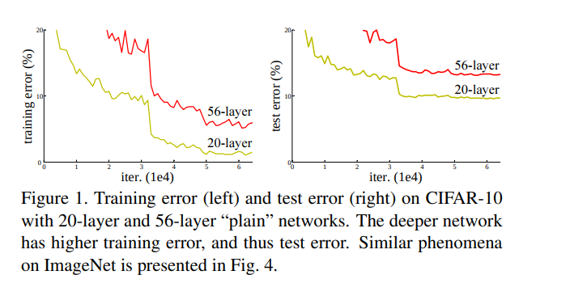
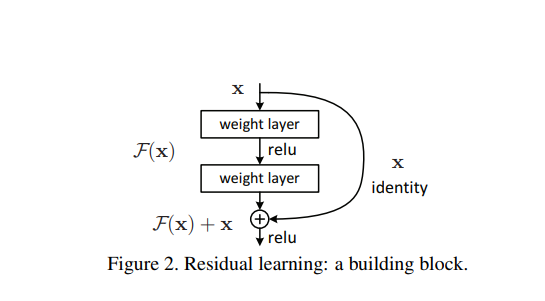

# [Deep Residual Learning for Image Recognition](https://arxiv.org/abs/1512.03385)

## Introduction

+ depth is important for image classification and leading results uses very deep architectures on ImageNet dataset

+ Question - is learning better networks as easy as stacking more layers?
+ Problem - Exploding/Vanishing gradient -- mitigated by batch normalization and better initialization
+ Problem - Performance degradation during convergence of deep networks -- with increase of depth of network, accuracy gets  saturated and hen degrades rapidly -- this is not caused by overfitting  and adding more layers to suitably deep models leads to higher training accuracy. *This is the problem addressed by this paper*.
+ degradation indicates -- not all systems are similarly easy to optimize.
+ Solution by construction -- shallow network with deeper identity layers -- shouldn't perform worse than the shallow network, but experiments shows otherwise.
+ addressing **degradation problem** -- explicitly let the layers fit a residual mapping instead of fitting original underlying mapping.
+ x -- input, H(x) -- underlying mapping. We fit F(x) = H(x)-x => H(x) = F(x)+x
+ hypothesis -- if identity mapping were optimal, it would be easier to push the residual to zero than to fit an identity mapping by a stack of nonlinear layers.
+ F(x) + x -- feedforward with shortcut connections -- connections skipping one or more layers.

## Related work

*SKIPPING FOR NOW*

## Deep Residual Learning

+ H(x) -- underlying mapping to be fit by stacked layers, x is input to the first of the layers

+ if multiple nonlinear layers can asymptotically approximate complicated functions, then these layers can also approximate the residual functions: H(x) - x
+ Stacked layers are allowed to approximate H(x) - x, instead of approximating H(x)
+ motivated by counterintuitive phenomena about degradation problem. If added layers are identity mappings, deeper models shouldn't have worse performance than shallower models. The degradation problem indicates that solvers may have difficulties in approximating identity mappings by multiple nonlinear layers. In residual learning, solvers may optimize by driving the layer weights towards zero to approximate identity mappings.
+ If optimal functions are closer to an identity mapping than to a zero mapping, it should be easier for the solvers to find changes with reference to an identity mapping, than to learn the function as a new one.
+ y = RELU(F(x) + x) -- nonlinearity is applied after logits and inputs are elementwise added. F(x) and x should have same dimension. If the dimensions are different we can use a linear projection to match the dimensions: y = RELU(F(x) + proj(x))
+ form of residual function, F is flexible. The paper uses a function with 2 or 3 layers. Single layer F might not be have any advantages.
+ F(x) can represent multiple Conv layer. Elementwise addition is performed on two feature maps, channel by channel.

+ Plain network - -inspired by VGG -- 2 design rules -- a) for same output size, layers have same number of filter b) if output size is halved, number of filters is doubled. Downsampling is performed by CNN with stride=2. Final CNN layer output is averaged pool into a 1000 way fully connected layer with softmax. Total weighted layers -- 34.
  
+ ResNet has fewer filters and lower complexity than that of VGGNet.
+ 34 layer plain + shortcut connections == resnet, if the dimensions of inputs and outputs don't match -- a) use extra zero padding for the increasing dimensions or b)use projection to match the dimensions (using 1x1 CNNs)
+ Implementation: 
    * Training
      1. image is resized with its shorter side randomly sampled in (256,480) for scale augmentation (*need to see VGGNet paper*).
      2. A 224X224 crop is randomly sampled from an image or its horizontal flip, with per pixel mean subtracted. Standard color augmentation is used. (*need to see AlexNet paper*).
      3. Added batch normalization after each convolution before activation. (*need to see Batch normalization paper of S. Ioffe*).
      4. Weights were initialized using a initialization method. (*need to see Delving deeper into rectifiers: ... by K. He*)
      5. Trained all the layers from scratch.
      6. SGD with mini-batch size of 256, weight decay 0.0001, momentum 0.9.
      7. Learning rate: started from 0.1 and is divided by 10, when error plateaus.
      8. Trained up to 60,000 epochs.
      9. No dropout was used according to BN paper.
    
    * Testing
      1. adopted standard 10-crop testing (*need to see AlexNet Paper*)
      2. adopted fully convolutional form and average scores at multiple scales -- {224, 256, 384, 480, 640} (*didn't understand this part, see -- Kaiming  He paper and VGGNet paper*)

## Experiments

#### ImageNet 2012 classification dataset
 - 1000 classes
 - 1.28 million training images
 - 50k validation images
 - 100k test images
 - evaluated top-1 and top-5 error rates.

- A = ResNet with zero padded shortcuts | B = projection shortcuts are used for increasing dimensions other shortcuts are identity | C = all shortcuts are projections
- the small differences among A/B/C indicate that projection shortcuts are
not essential for addressing the degradation problem

#### Bottleneck Architectures

 - Needed faster training, so redesigned residual function as a *bottleneck* design.
 
 - each residual function F is a stack of 3 layers -- 1x1, 3x3 and 1x1 convolutions
 - 1x1 layers are responsible for reducing and restoring dimensions.
 - identity shortcuts are very important for bottleneck architectures, if identity is replaced by projections -- model size and complexity will be doubled as the shortcut would be connected to two high dimensional ends. So, identity is more efficient in these bottleneck designs.
 - ResNet30 - 2 Layer F + 3 Layer bottleneck F = ResNet50
 
 
 
 - ResNets have lower layer responses -- supports the hypothesis that residual functions might be generally closer to zero than non residual functions. Deeper ResNets have smaller magnitudes of responses. When there are more layers, individual layer of ResNets tends to modify the signal less.
 - Deeper, 1202-layer ResNet have testing error higher than 110-layer ResNet, authors argue in favor of overfitting.