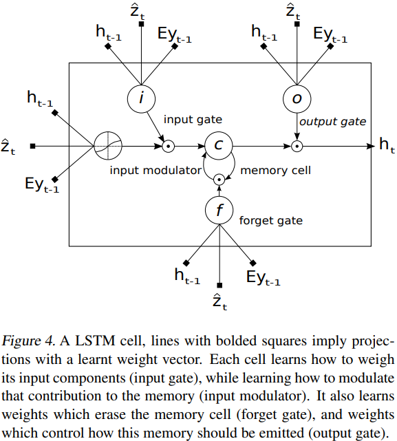
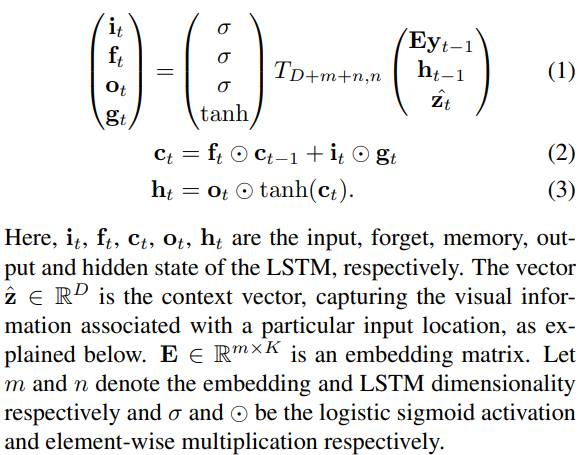
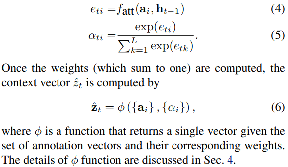
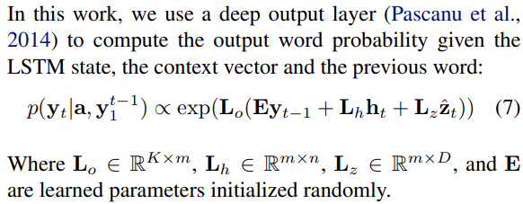
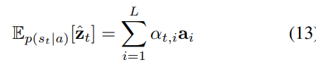
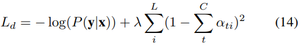
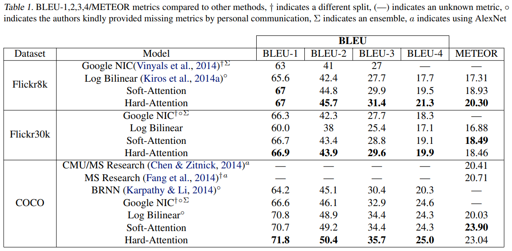

# [Show, Attend and Tell: Neural Image Caption Generation with Visual Attention](https://arxiv.org/pdf/1502.03044.pdf), Kelvin Xu, et al.

## Abstract
- attention based model for describing the contents of images
- training the model using backpropagation
- visualization shows attention

## Introduction
- Caption generation is related to scene understanding
- caption generation is difficult: computers need to know what objects are in image and what are the relationship among them
- attention: one of the most interesting thing about human vision → allows salient features of images to come to the forefron dynamically → needed specially when there's clutter in image
- Hard attention & Soft attention

**Contributions:**  
- Hard & Soft attention based image caption generators.
- Visualize where and what the model is focused on.
- SOTA on three benchmark datasets: Flickr8K, Flickr30k, MS COCO

## Related Work
- Encoder-Decoder framework is suitable for captioning because captioning is analogous to "translating" an image to a sentence
- Most of the works represent images as a single feature vector from the deepest layer of a pretrained CNN.
- Some papers incroporated object detection in caption generation
- This paper's model learns latent alignments from scratch using attention mechanism → can go beyond "objectness" and learn to attend to abstract concepts
- Prior works (before NNs) have two main approaches:
    1. Generate caption templates and fill them up depending on the object detection and attribute discovery
    2. Retrieve similar captioned images from large database and modify these retrieved captions to fit the query → had intermediate generalization step to remove the specifics of a caption that are only relevant to the retrieved image, e.g. name of a city.

## Image Caption Generation with Attention Mechanism

### Model Details

**Encoder: Convolutional Features**  
- Use CNN to extract a set of annotation vectors → feature vector
- Encoder produces set of L vectors each of which is a D-dimensional representation corresponding to a part of the image
- Features are extracted from the deeper CNN layer. CNN's different feature maps focus on different parts of an image which allows the decoder to selectively focus on certain parts of an image by selecting a subset of all feature vectos.

**Decoder: LSTMs**  
- LSTM produces one word at every time step conditioning on a context vector, previous hidden state and the previously generated words.

- Context vector **`Z_t`** is computed from the annotation vectors `a_i`, `i=1,2,3,....,L`. For each location `i`, attention mechanism generates a positive weight `α_i` which can be interpreted as `i` is the right position to look for generating the next word in the caption (Hard Attention) or as relative importance given to position `i`, blending all `a_i's` together.
- `α_i's` are computed by an attention model `f_att` and we use a MLP conditioned on the previous hidden state `h_t-1`

- Initial memory state and hidden state of the LSTM are predicted by an average of the annotation vectors fed through two separate MLPs.

- ↑ didn't get how we were using `L_h, L_z` in the actual implementaion

## Learning Stochastic Hard vs Deterministic Soft Attention
### Stochastic Hard Attention
- `s_t` is location variable representing where the model decides to focus attention when generating the `t_th` word.
- `s_t,i` is an indicator one-hot variable which is set to 1 if the `i-th` location is the one used to extract visual features.
- **Didn't Understand Stochastic Hard Attention**

### Deterministic Soft Attention
- Hard Attention needs sampling of the attention location `s_t` each time
- For soft attention take the expectation of the context vector: and formulate a deterministic attention model by computing a soft attention weighted annotation vector: ∑`α_i*a_i` 
- The model is smooth and differentiable under the deterministic attention, so learning end-to-end is trivial by using backpropagation.
- **There are some other mathematical language in this section that I didn't understood**    

**Doubly Stochastic Attention:**  
- Added doubly stochastic regularization where `∑α_ti ≈ 1` is added → encouraging the model to pay equal attention to every part of the image → improved BLEU score significatly and leads to more rich and descriptive captions.
- Additionally predict a gating scaler β from the previous hidden state at each time step and multiplies attended context vector elementwise
- β is calculated as `σ(f_β(h_t-1))`
- β helps the attention weights to put more emphasis on objects in the images.

### Training Procedure + Experiments
- RMSProp and Adam as optimizer
- VGGNet as encoder without finetuning
- Fixed length preprocessed captions with minibatch size of 64
- Dropout + Early stopping on BLEU score
- Vocabulary Size: 10k
- Used Karpathy Caption splits
- Depending on Encoder architecture, performance may vary
- For visualization, Upsample and apply gaussian filter.
- From visualization, we can understand why model is making mistake.

## Conclusion
- proposed attention-based model achieves SOTA on several benchmark datasets using BLEU and METEOR metric.
- show that learned attention can be exploited to give more interpretability to how the model generates the captions.