# [SSD: Single Shot MultiBox Detector](https://arxiv.org/pdf/1512.02325.pdf)

## Abstract
- method for training single DNN for detecting objects in images
- SSD discretizes the output space of bboxes into a set of default boxes over different aspect ratios and scales per feture map location.
- During prediction, network outputs scores for the presence of object at teach default box and produce adjustments to the box to better match the object's shape.
- Combines predictions from multiple feature maps from different levels (resolutions) to automatically handle objects of various sizes.
- eliminates region proposal and pixel resampling phase.
- Empirical experiments show that SSD is much faster while having competitive accuracy to RCNN and its variants.

## Introduction

- Region based Object detection: hypothesize bbox -- resample pixels for each box -- apply high quality classifier.
- Region based methods are computationally expensive for embedded systems and slow for real-time applications.
- Significant speed-up came at the cost of decreased detection accuracy.
- SSD: speed up the process by eliminating the region proposal and pixel sampling phase.
- Added series of improvements: using a small conv filter to predict object categories and offests in bboxes; using separate predictors for different aspect ratio detections; apply separate filter to multiple feature maps from later stages of a network to perform detection at multiple scales.

**Contributions:** 
- SSD
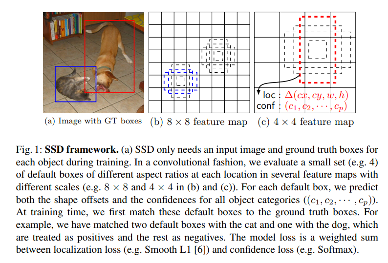
## The Single Shot Detector (SSD)

- SSD NN -- feedforward convnet produces fixed-size collection of bounding boxes and scores for the presence of object class instances in those boxes → Non Maximum Suppression (NMS) to produce final output
- Architecture: BaseNetwork → Auxiliary layers → prediction layers

- **Key Features**:
    1. *Multi-scale feature maps:* added convolutional feature layer after basenetwork that allows detection at multiple scales. Each feature layer has separate convolutional predictor.(**?**)
    2. *Convolutional Predictors for Detection:*  each feature layer can predict a fixed set of detections using a set of convolutional filters. bbox offsets are measured relative to a default box position relative to each feature map location. Apply, 3X3Xp kernel to mXnXp → at each of mXn location ⇒ a prediction for a class or an offest for a bbox corner
    3. *Default boxes and aspect ratios:* associate a set of default bboxes for each feature map cell, position of each boxes relative to it's cell is fixed. For each feature map cell, predict offsets relative to the default boxes in that cell and per-class scores for each of the predicted offsets. For each box out of *k* at a location, compute *c* class scores and *4* bbox offsets relative to the original default box. So we need *c+4* filters per box and in total *(c+4)k* filters per position to generate prediction. If feature map shape is mXn, then we have *(c+4)kmn* output for that feature map. Default boxes are applied to several feature maps to detect objects of varying shapes.'
 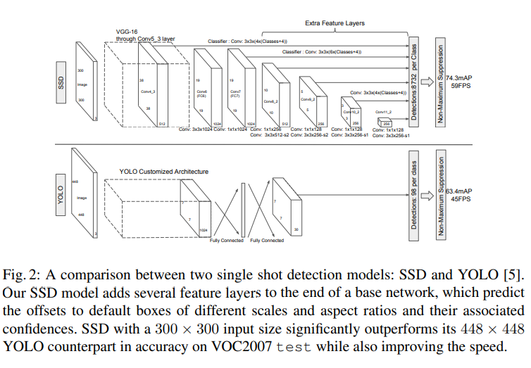
- Training: difference between Region based detector and SSD → ground truth information need to be encoded, i.e. assigned to specific outputs in the fixed set of detector outputs, also need to choose set of default boxes and scales for detection and implement hard negative mining and data augmentation strategies.
1. **Matching Strategy**: need to determine which default boxes correspond to a ground truth detection → for each GT box, need to select default boxes that vary over location, aspect ration and scale → match each GT box to the default box with the best jaccard overlap → match default boxes to any GT box with jaccard overlap higher than a threshold (0.5) ⇒ allow network to predict high scores for multiple overlapping default boxes
2. **Cost Function / Training Objective:** derived from MultiBox objective → extended to handle multiple object categories → overlall loss is a weighted sum of cross-entropy loss for categories and localization (Smooth-L1) loss for the coordinates, which is averaged by the number of matched default boxes (positive matches), N, if N=0, loss=0 (1) → Regress to offsets for the center (cx,cy) of the default bbox and its width and height(2) → confidence loss is softmax loss over multiple classes.
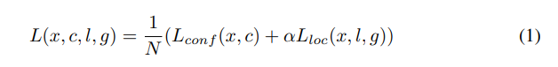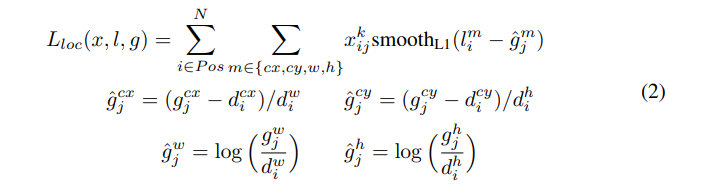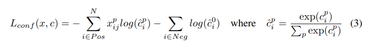
3. **Scales and Aspect Ratios for Default Boxes**: using feature maps from different layers ⇒ can handle objects at different scales while sharing parameters across scales; deeper layers capture fine detail of objects ⇒ better semantic segmentation; adding global context pool from a feature map (global pooling) ⇒ help smooth segmentation results ⤞ use lower and upper layer feature maps for detection → specific feature maps learn to be responsive to particular scales of objectss.   
For using m, feature maps, scale of the default boxes is computer as: 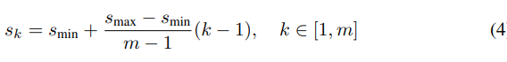
where smin = 0.2 and smax = 0.9, i.e. lowest layer scale = 0.2 and highest layer scale = 0.9, regularly spacing all layers in between → aspect ratios: {1,2,3,1/2,1/3} → compute width w = sk\*root(ar), height, h = sk/(root(ar)) → for aspect ratio of 1, add a default box with scale: sk = root(sk\*sk+1) → 6 default boxes per location, center: ((i+0.5)/|fk|, (j+0.5)/|fk|) for i, j ∈ [0, |fk|]  

4. **Hard Negative Mining:** balances the number of positive and negative instances → choose only those negative examples which are the most wrong → positive to negative ratio can be set (e.g., 1:3)  

5.  **Data Augmentation:** to make model more robust to: randomly select from the following options:
    - apply random photo-metric distortions
    - use entire original image
    - sample a patch so that minimum jaccard overlap with the objects is 0.1, 0.3, 0.5, 0.7 or 0.9 (zoom in)
    - randomly sample a patch (zoom out **?**)
    - keep GT box if center of the box lies in the sampled patch, otherwise discard it
    - Resize to a fixed size and randomly flip horizontally
    - conv4_3 has different scale than other FMs, so use L2 normalization to normalize the FMs using an initial scale of 20 followed by learning that scale.

## Experimental Results

#### Configuration:
 - Used VGG16, pretrained on ImageNet
 - Converted fc6, fc7 to equivalent convolutional layer similar to DeepLab implementation, sample parameters, use atrous filters to fill the holes
 - convert pool5 from 2X2 - s2 to 3X3 - s1, 
 - use SGD: LR:1e-3, momentum: 0.9, weight decay: 5e-4, batch size: 32, fixed LR decay policy
 
#### Results
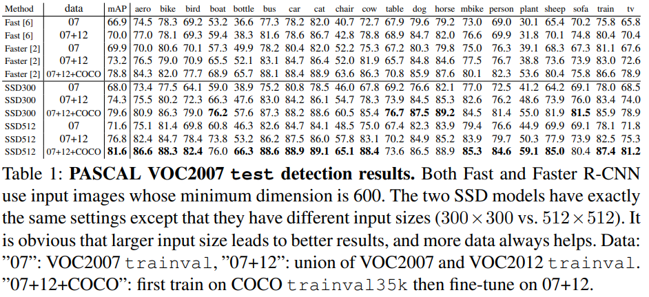

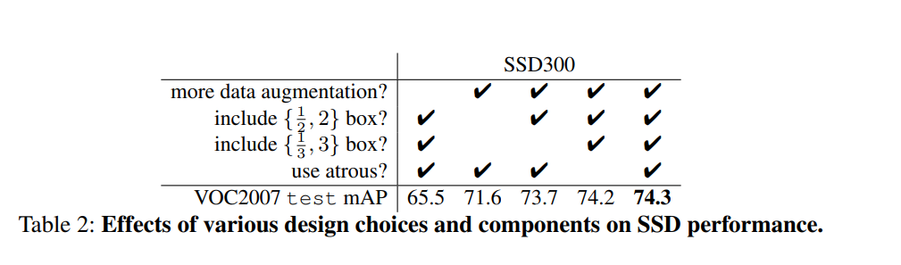
**∴ Data Augmentation is crucial**  
**∴ More default box shapes is better**  
**Atrous is faster.**
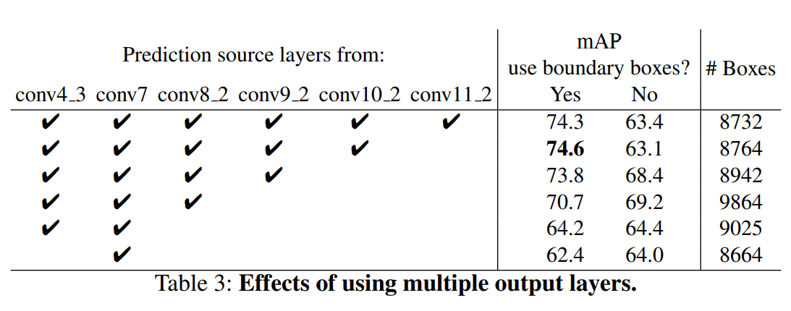
**∴ Multiple output layers at different resolutions is better**
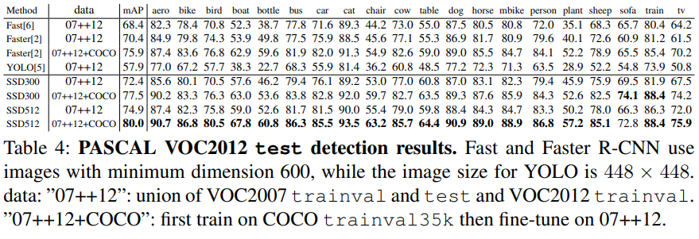
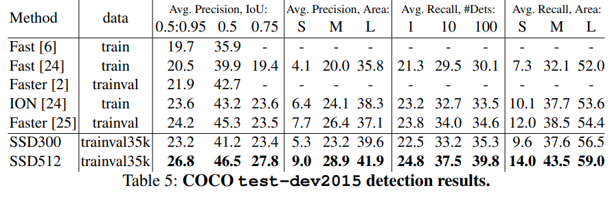

#### Inference
- Non Maximum Suppression is used
- Filter threshold: 0.01, max jaccard overlap: 0.45 per class
- topk = 200
- SSD300 → real time, SSD512 → can be made real time by using faster base network (~80% of the forward pass is spent in base network)

## Related Work

- Two methods for object detection: Sliding window based, region proposal based.
- Before CNNs, SOTA was: Deformable Part Model (DPM) for sliding window based models and Selective Search for region proposal based models.
- SPPNet, R-CNN, Fast-RCNN, Faster-RCNN
- SSD is similar to Faster-RCNN in a way that SSD and Faster-RCNN both uses a fixed set of default boxes for predictions.
- OverFeat, YOLO -- single shot detectors -- SSD can be reduced to these

## Conclusions
- Introduced SSD
- Uses multi-scale convolutional bounding box outputs attached to multiple feature maps at the end of the network.